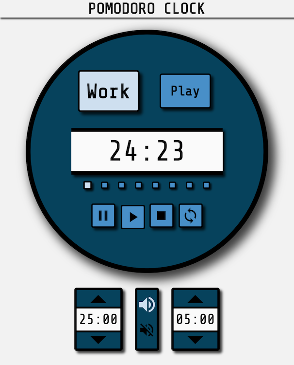

# Project: Pomodoro Clock

The [Pomodoro Technique](https://en.wikipedia.org/wiki/Pomodoro_Technique)
is a time management method where work is broken up into short intervals, usualy 25 minutes, with a 5 minute break in between.
During the work time, all distractions are left out and the focus is solely on getting things done.
This JavaScript based clock is designed specifically for use with the Pomodoro Technique.

The functional inspiration was taken from [Romantic Trouble's](https://en.wikipedia.org/wiki/Pomodoro_Technique) Pomodoro clock but the JavaScript codebase was all original.
The Romantic Trouble's version depends heavily on JQuery while this implendation is written with plan vanilla ES6 JavaScript.  

### [Use clock in browser](https://winplam.github.io/pomodoro/)

# Goals and Postmortem
I wanted to make this close and functional and usable as possible while making it beautiful to look at.
The core timing and program logic was straightforward but coordinating all the button animations to trigger at the proper sequence was much trickier than anticipated.
But I think the effort paid off with a more lively clocked and the addition of sound is a nice touch.  

## Screenshot

## JavaScript Features Used
Some notable JS features used for this project where setInterval and the new Date methods.
These were absolutely needed to work properly time time and intervals. 

## Technologies Used
The technologies used for creating this clock are HTML 5, CSS 3, JavaScript and WebStorm IDE.